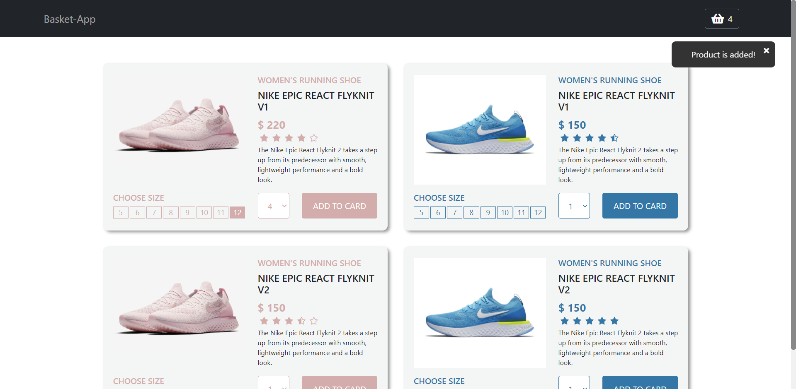
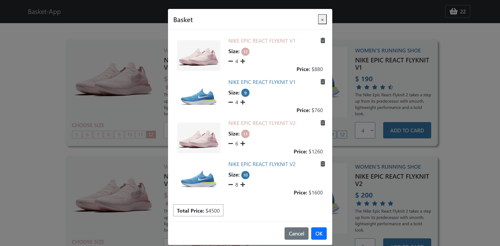

# 138 Reengen Full-Stack Bootcamp | Week-1 Homework

Shopping Application built in VueJs.

# [Live Demo](https://vue-basketapp-week-1-gokberk.netlify.app/)

## Shopping Application

### Content of Project

- Shopping Application displays products with product category, name, rating, detail, price etc.
- User can add product into basket with product size and number.
- Notifications are showed in case the size is not selected and the product is added to the basket.



- Basket shows selected products and groups the products if they are same type, color and size.
- User is able to increase or decrease number of products and delete the product group.



### Build With

- HTML5
- CSS
- [BootstrapVue](https://bootstrap-vue.org/)
- [VueJs](https://vuejs.org/)


#### Project setup
```
npm install
```

##### Compiles and hot-reloads for development
```
npm run serve
```

##### Compiles and minifies for production
```
npm run build
```

##### Lints and fixes files
```
npm run lint
```

##### Customize configuration
See [Configuration Reference](https://cli.vuejs.org/config/).
